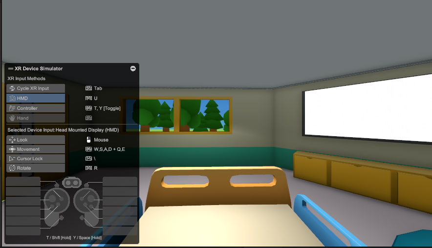

# Portfolio

Hello, My name is Glib Omelnytskyi. I started working as a Unity developer in 2020. During this time I create a lot of games and projects, thats will be described here.

## Resume

📄 [Resume (PDF)](CV/OmelnytskyiCV.pdf)

##Links

https://www.linkedin.com/in/glib-omelnytskyi-a1847b173/
omelniskij@gmail.com
https://t.me/Glib_Omelnytskyi

## About me

- almost 5 years of commercial Unity development
- Mobile (Hyper Casual, Puzzle, Midcore)
- PC VR prototype
- Strong focus on architecture and optimization

Main stack:

- Unity
- C#
- Zenject and VContainer
- async operation (UniTask, DOTween, ...)
- Optimization (Profiler, Addressables, batching)
- SDK (Firebase, Applovin, IronSource)
- mobile, pc, VR/AR and web platforms
- REST API
- Git

---

## Portfolio

This repository contains references to my pet projects and videos of a gameplay from the commercial projects, because of NDA, I cannot publish the source code of commercial projects.

---

### DadGames
Mobile, VR, PC

Casual:

Puzzle Lore
[PuzzleLoreMeta.mov](DadGames/PuzzleLoreMeta.mov)
[PuzzleLoreGameplay.mov](DadGames/PuzzleLoreGameplay.mov)
* Heroes and items crafting&upgrading system;
* Map system;
* Heroes and enemies spells;
* Reduce launch time;
* Ui;
* cheats;
* editor tools;

Hybrid:

Puzzle-Match https://play.google.com/store/apps/details?id=com.SparksGames.JumWorldMatchPuzzleGame [GameplayPuzzleMatch.mp4](DadGames/GameplayPuzzleMatch.mp4)
* Match-3 gameplay, Level map and other UI;
* Firebase sdk: analytics, config, crashlytics, messaging;
* Ads: AdMob, IronSource and some of cmp sdk;
* Adjust

FruitSwipe https://play.google.com/store/apps/details?id=com.SparksGames.FruitSwipe [GameplayFruitSwipe.mp4](DadGames/GameplayFruitSwipe.mp4)
* Gameplay Mechanics;
* UI;
* Integrated and configured sdk;

Hyper:

[GameplayOneLine.mp4](DadGames/GameplayOneLine.mp4)
[GameplayCosmoPanda.mp4](DadGames/GameplayCosmoPanda.mp4)
[GameplayCookieSplit.mp4](DadGames/GameplayCookieSplit.mp4)
* Gameplay, Meta, Sdk;

VR 
* Analytics;
* GPU optimization;

### Enixan Entertainment
Mobile

Yukon family https://www.youtube.com/watch?v=KXyLrSLKrLY https://play.google.com/store/apps/details?id=com.enixan.yukon.family.adventure
* Upgrading building;
* Add new nits (animals, landscape objects,..);
* Battlepass system;
* Ui;

Oregon trail https://www.youtube.com/shorts/RRZY-Gk2HE0 https://play.google.com/store/apps/details/The_Oregon_Trail_Boom_Town?id=com.tiltingpoint.oregon.trail.settlers&hl=en_AU
* Event gameplay Mechanics;

### Murka (outstaff)
Mobile

Wordelicious 1 https://www.youtube.com/shorts/cFZ6DPGEwKg https://play.google.com/store/apps/details?id=com.murka.word.wordelicious.crossword
* Created level editor. In particular, the selection word algorithm for the crossword was greatly optimized;
* Setup ads;
* UI;
* Analytics;

Braindoku https://www.youtube.com/watch?v=pz7LbIfnaTI https://play.google.com/store/apps/details?id=com.murka.braindoku.sudoku.block.puzzle
* Gameplay: rotating, auto hint, difficult curve;
* UI;
* Effects (Animation, particles);
* Settuped analytics and ads;

Wordelicious food&travel https://www.youtube.com/watch?v=uh0YjDguu9I https://play.google.com/store/apps/details?id=com.murka.word.wordelicious.food.travel
* UI, animation, vfx, audio;
* New gameplay modes;
* Meta: quests, daily rewards;
* Cloud features: cloud saving, leaderboard;
* Build size optimization;
* Perfomance optimization;
* ReDesign;

Blackjack 21 https://www.youtube.com/watch?v=_RhZQFw00H4 https://play.google.com/store/apps/details?id=com.murka.blackjack.cards21
* Bugfixes;
* Code refactoring;
* Live-ops;

Also in AlphaNova helped/work on AR and WebGl projects

### PetProjects

Armored Car https://github.com/Gleb-Omelnitskji11/CarZomboid

* Different enemies, modular player car;
* dynamic ground;
* gpu instancing,
* object pooling enemies and bullet;

Robot platformer https://github.com/Gleb-Omelnitskji11/Platformer

Football https://bitbucket.org/GlOme/workspace/projects/LAG

Multiplayer football by mirror
